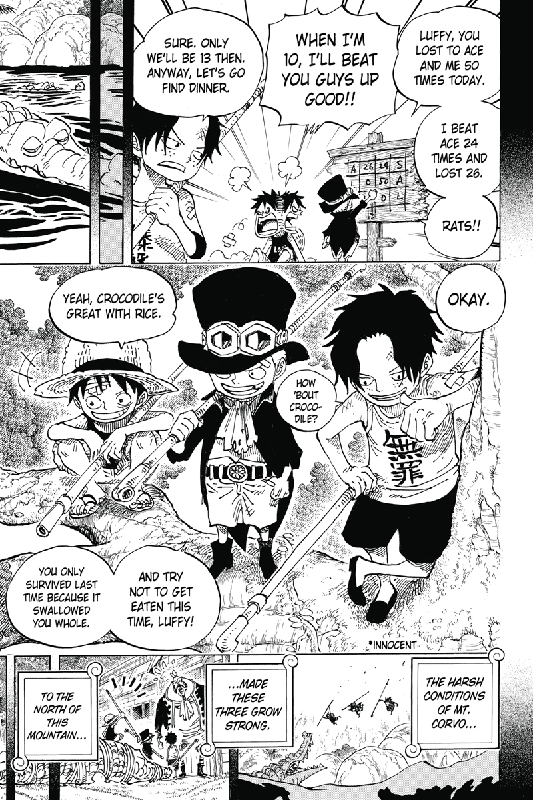
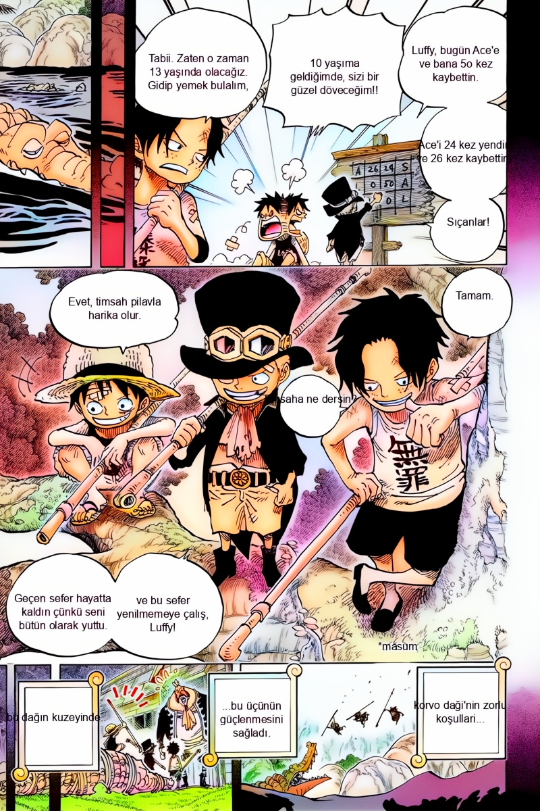
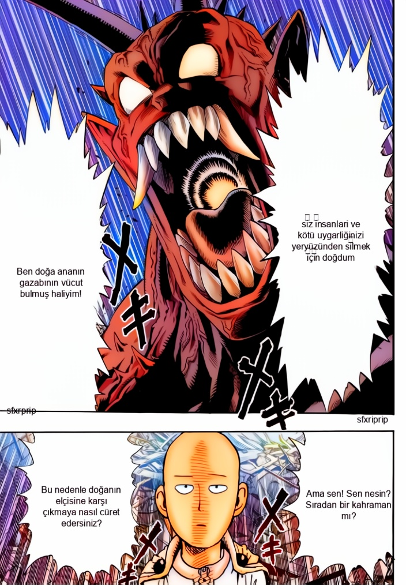
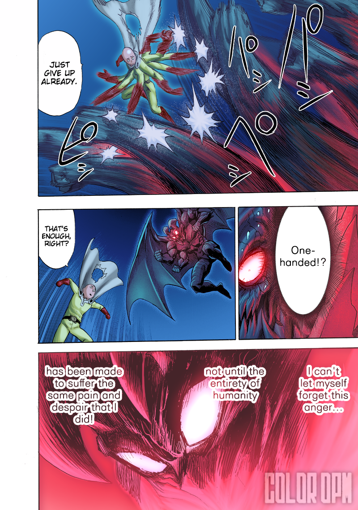
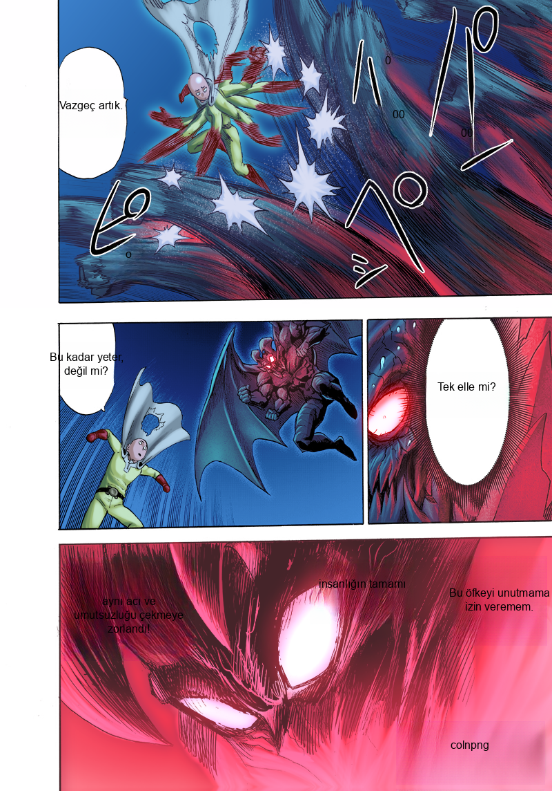

# Manga Comic Colorization and Translation v2

<div align="center">


**An AI-powered solution for manga and comic translation and colorization**

*Yapay zeka destekli manga ve çizgi roman çeviri ve renklendirme çözümü*
## 📎 Live Demo - Canlı Demo

[](https://huggingface.co/spaces/koesan/mangaspaces)

**🇬🇧 Try the previous version of Evoars on Hugging Face (CPU-based, processing may be slower)**  
**🇹🇷 Evoars'ın önceki sürümünü Hugging Face'te test edin (CPU tabanlı, işlem daha yavaş olabilir)**

These repositories contain other versions of the project:

**Advanced Version / Gelişmiş Sürüm**: [Evoars](https://github.com/koesan/Evoars)  

**Older Version / Eski Sürüm**: [Manga Çizgi Roman Çeviri V1](https://github.com/koesan/manga_cizgi_roman_ceviri_v1)

---

🇬🇧[English](#english) | 🇹🇷[Türkçe](#türkçe)

</div>

### Sample Results

| Input | Output |
|-------|---------|
|  |  |
|  |  |
|  |  |

---

## English 

### 🇬🇧

### Overview

This project combines advanced computer vision and natural language processing techniques to automatically translate and colorize manga and comic pages. The system utilizes state-of-the-art OCR technology, neural machine translation, image inpainting, and deep learning-based colorization to transform black and white manga pages into translated, colorized versions.

### Key Features

### 🔍 Optical Character Recognition (OCR)

In this system, text extraction is performed using the **PaddleOCR** engine. This framework is optimized for manga-style content, provides higher accuracy compared to EasyOCR and PyTesseract, and supports multilingual recognition.

### 🌐 Advanced Translation System

The translation process is built on the **DeepL API** to ensure professional-level accuracy. It supports flexible use across different language pairs and includes automatic retry mechanisms for error handling.

### 🎨 AI-Powered Image Inpainting

Text removal from speech bubbles and appropriate image completion are carried out with the **Simple-LAMA algorithm**. This approach reconstructs the background in a way that is consistent with the visual context.

### 🌈 Neural Network-Based Colorization

For the colorization stage, a **ResNeXt-based generator network** is used. This architecture is taken directly from the [manga-colorization-v2](https://github.com/qweasdd/manga-colorization-v2) project, enabling automatic colorization of black-and-white manga panels.

### Technical Architecture

```
Input Image → OCR Processing → Text Extraction → Translation → Inpainting → Text Overlay → [Optional] Colorization → Output
```

#### Core Components

1. **Text Detection Pipeline**
   - Image preprocessing and noise reduction
   - Advanced OCR with PaddleOCR
   - Text region identification and grouping
   - Coordinate-based text positioning

2. **Translation Engine**
   - DeepL API integration
   - Text preprocessing and cleaning
   - Language detection and conversion
   - Error handling and validation

3. **Image Processing Pipeline**
   - LAMA-based inpainting for text removal
   - Custom font rendering for translated text
   - Adaptive text sizing and positioning
   - Quality preservation throughout processing

4. **Colorization Network**
   - ResNeXt-based generator architecture
   - FFDNet denoiser for image enhancement
   - Spectral normalization for stable training
   - Multi-scale feature extraction

### Requirements

#### System Requirements
- **Python**: 3.8 or higher
- **GPU**: CUDA-compatible GPU (recommended for faster processing)
- **RAM**: Minimum 8GB, 16GB recommended
- **Storage**: At least 2GB free space for models and processing

#### Dependencies
```bash
deepl==1.17.0
paddleocr==2.7.3
paddlepaddle==2.6.1
simple-lama-inpainting==0.1.0
torch==2.2.2
torchvision==0.17.2
tqdm==4.66.2
textwrap3==0.9.2
pillow==9.5.0
opencv-python>=4.5.0
numpy>=1.21.0
```

### Installation Guide

#### Step 1: Environment Setup
Create and activate a virtual environment:

**Linux/macOS:**
```bash
python3 -m venv manga_env
source manga_env/bin/activate
```

**Windows:**
```bash
python -m venv manga_env
manga_env\Scripts\activate
```

#### Step 2: Install Dependencies
```bash
pip install deepl==1.17.0 paddleocr==2.7.3 paddlepaddle==2.6.1 simple-lama-inpainting==0.1.0 torch==2.2.2 torchvision==0.17.2 tqdm==4.66.2 textwrap3==0.9.2 pillow==9.5.0
```

#### Step 3: Clone Repository
```bash
git clone https://github.com/koesan/Manga_Comic_Colorization_and_Translation_v2.git
cd Manga_Comic_Colorization_and_Translation_v2
```

#### Step 4: Download Model Files
1. Download the [generator.zip](https://drive.google.com/file/d/1qmxUEKADkEM4iYLp1fpPLLKnfZ6tcF-t/view) file
2. Extract and place the contents in the `networks/` directory
3. Ensure the following structure:
   ```
   networks/
   ├── generator.zip (extracted contents)
   ├── extractor.py
   └── models.py
   ```

#### Step 5: API Configuration
1. Register for a DeepL API account at [DeepL Pro API](https://www.deepl.com/en/pro-api)
2. Obtain your API key
3. Open `main.py` and replace the empty string on line 13:
   ```python
   api = "YOUR_DEEPL_API_KEY_HERE"
   ```

### Usage Instructions

#### Basic Usage

1. **Prepare Input Files**
   - Place manga pages in the `manga/` directory
   - Supported formats: `.jpg`, `.jpeg`, `.png`, `.webp`

2. **Configure Settings**
   - **Colorization**: Set `renklendir = 1` (line 12) to enable, `0` to disable
   - **API Key**: Ensure your DeepL API key is configured (line 13)

3. **Run Processing**
   ```bash
   python3 main.py
   ```

4. **Retrieve Results**
   - Processed images will be saved in the `result/` directory
   - Filenames will match the original input files

#### Advanced Configuration

**Translation Language Pairs**
Modify the translation target language in the `translators` function (line 84):
```python
output = str(translator.translate_text(text, target_lang="TR"))  # Change "TR" to desired language
```

**Supported Language Codes**
- EN (English)
- DE (German)
- FR (French)
- ES (Spanish)
- IT (Italian)
- JA (Japanese)
- TR (Turkish)
- And many more...

### Project Structure

```
Manga_Comic_Colorization_and_Translation_v2/
├── main.py                 # Main execution script
├── colorizator.py         # Colorization model implementation
├── denoising/            # Image denoising components
│   ├── denoiser.py       # FFDNet denoiser implementation
│   ├── models.py         # Denoising model architectures
│   ├── functions.py      # Utility functions
│   └── utils.py          # Helper utilities
├── networks/             # Neural network models
│   ├── models.py         # Generator and discriminator models
│   ├── extractor.py      # Feature extraction networks
│   └── generator.zip     # Pre-trained model weights
├── manga/               # Input directory for manga files
├── result/              # Output directory for processed files
├── resimler/           # Sample images for demonstration
└── README.md           # Project documentation
```

### Performance Optimization

#### GPU Acceleration
For faster processing with CUDA-enabled GPUs:
```python
colorizator = MangaColorizator("cuda", 'networks/generator.zip','networks/extractor.pth')
```

#### Batch Processing
The system automatically processes all supported images in the `manga/` directory with progress tracking via tqdm.

### Troubleshooting

#### Common Issues

**1. CUDA Out of Memory**
```python
# Switch to CPU processing
colorizator = MangaColorizator("cpu", 'networks/generator.zip','networks/extractor.pth')
```

**2. DeepL API Quota Exceeded**
- Check your API usage in the DeepL console
- Consider upgrading your plan for higher limits

**3. Font Rendering Issues**
Ensure Arial font is available on your system:
- **Linux**: `sudo apt-get install ttf-mscorefonts-installer`
- **Windows**: Font should be available by default
- **macOS**: Install Microsoft fonts or modify font path in code

**4. OCR Accuracy Issues**
- Ensure input images have sufficient resolution (minimum 300 DPI recommended)
- Check that text regions are clearly visible and not heavily stylized

### Acknowledgments

- Original colorization network based on [manga-colorization-v2](https://github.com/qweasdd/manga-colorization-v2)
- OCR functionality powered by [PaddleOCR](https://github.com/PaddlePaddle/PaddleOCR)
- Inpainting implementation using [Simple-LAMA-Inpainting](https://github.com/enesmsahin/simple-lama-inpainting)
- Translation services provided by [DeepL API](https://www.deepl.com/docs-api)

---

## Türkçe

### 🇹🇷

### Genel Bakış

Bu proje, manga ve çizgi roman sayfalarını otomatik olarak çevirmek ve renklendirmek için gelişmiş bilgisayarlı görü ve doğal dil işleme tekniklerini birleştirir. Sistem, en son OCR teknolojisi, sinir ağı tabanlı makine çevirisi, görüntü tamamlama ve derin öğrenme tabanlı renklendirme kullanarak siyah beyaz manga sayfalarını çevrilmiş ve renklendirilmiş versiyonlara dönüştürür.

### Temel Özellikler

### 🔍 Optik Karakter Tanıma (OCR)

Sistemde metin çıkarma işlemleri **PaddleOCR** motoru ile gerçekleştirilmektedir. Manga tarzı içerikler için optimize edilen bu altyapı, EasyOCR ve PyTesseract’a göre daha yüksek doğruluk sağlar ve çok dilli tanıma desteği sunar.

### 🌐 Gelişmiş Çeviri Sistemi

Çeviri süreci, profesyonel seviyede doğruluk için **DeepL API** üzerine kuruludur. Farklı dil çiftlerinde esnek kullanım sağlar ve hata durumlarında otomatik yeniden deneme mekanizmaları içerir.

### 🎨 Yapay Zeka Destekli Görüntü Tamamlama

Konuşma balonlarından metin kaldırma ve uygun görsel tamamlama işlemleri **Simple-LAMA algoritması** ile yapılmaktadır. Bu yöntem, arka planın bağlamına uygun yeniden yapılandırma sağlar.

### 🌈 Sinir Ağı Renklendirmesi

Renklendirme aşamasında **ResNeXt tabanlı üretici ağ** kullanılmakta olup bu mimari doğrudan [manga-colorization-v2](https://github.com/qweasdd/manga-colorization-v2) projesinden alınmıştır. Böylece siyah-beyaz manga panelleri otomatik olarak renklendirilir.

### Teknik Mimari

```
Giriş Görüntüsü → OCR İşlemesi → Metin Çıkarma → Çeviri → Tamamlama → Metin Ekleme → [İsteğe Bağlı] Renklendirme → Çıkış
```

#### Ana Bileşenler

1. **Metin Algılama Hattı**
   - Görüntü ön işlemesi ve gürültü azaltma
   - PaddleOCR ile gelişmiş OCR
   - Metin bölgesi tanımlama ve gruplama
   - Koordinat tabanlı metin konumlandırma

2. **Çeviri Motoru**
   - DeepL API entegrasyonu
   - Metin ön işlemesi ve temizleme
   - Dil algılama ve dönüştürme
   - Hata yönetimi ve doğrulama

3. **Görüntü İşleme Hattı**
   - Metin kaldırma için LAMA tabanlı tamamlama
   - Çevrilmiş metin için özel font görselleştirme
   - Uyarlanabilir metin boyutlandırma ve konumlandırma
   - İşlem boyunca kalite korunması

4. **Renklendirme Ağı**
   - ResNeXt tabanlı üretici mimari
   - Görüntü iyileştirme için FFDNet gürültü giderici
   - Kararlı eğitim için spektral normalleştirme
   - Çok ölçekli özellik çıkarma

### Gereksinimler

#### Sistem Gereksinimleri
- **Python**: 3.8 veya üzeri
- **GPU**: CUDA uyumlu GPU (daha hızlı işleme için önerilen)
- **RAM**: Minimum 8GB, 16GB önerilen
- **Depolama**: Model ve işleme için en az 2GB boş alan

#### Bağımlılıklar
```bash
deepl==1.17.0
paddleocr==2.7.3
paddlepaddle==2.6.1
simple-lama-inpainting==0.1.0
torch==2.2.2
torchvision==0.17.2
tqdm==4.66.2
textwrap3==0.9.2
pillow==9.5.0
opencv-python>=4.5.0
numpy>=1.21.0
```

### Kurulum Kılavuzu

#### Adım 1: Ortam Kurulumu
Sanal ortam oluşturun ve etkinleştirin:

**Linux/macOS:**
```bash
python3 -m venv manga_env
source manga_env/bin/activate
```

**Windows:**
```bash
python -m venv manga_env
manga_env\Scripts\activate
```

#### Adım 2: Bağımlılıkları Yükleyin
```bash
pip install deepl==1.17.0 paddleocr==2.7.3 paddlepaddle==2.6.1 simple-lama-inpainting==0.1.0 torch==2.2.2 torchvision==0.17.2 tqdm==4.66.2 textwrap3==0.9.2 pillow==9.5.0
```

#### Adım 3: Depoyu Klonlayın
```bash
git clone https://github.com/koesan/Manga_Comic_Colorization_and_Translation_v2.git
cd Manga_Comic_Colorization_and_Translation_v2
```

#### Adım 4: Model Dosyalarını İndirin
1. [generator.zip](https://drive.google.com/file/d/1qmxUEKADkEM4iYLp1fpPLLKnfZ6tcF-t/view) dosyasını indirin
2. İçeriği çıkarın ve `networks/` dizinine yerleştirin
3. Aşağıdaki yapının olduğundan emin olun:
   ```
   networks/
   ├── generator.zip (çıkarılan içerik)
   ├── extractor.py
   └── models.py
   ```

#### Adım 5: API Yapılandırması
1. [DeepL Pro API](https://www.deepl.com/en/pro-api) adresinden bir DeepL API hesabı oluşturun
2. API anahtarınızı alın
3. `main.py` dosyasını açın ve 13. satırdaki boş string'i değiştirin:
   ```python
   api = "DEEPL_API_ANAHTARINIZ_BURAYA"
   ```

### Kullanım Talimatları

#### Temel Kullanım

1. **Giriş Dosyalarını Hazırlayın**
   - Manga sayfalarını `manga/` dizinine yerleştirin
   - Desteklenen formatlar: `.jpg`, `.jpeg`, `.png`, `.webp`

2. **Ayarları Yapılandırın**
   - **Renklendirme**: Etkinleştirmek için `renklendir = 1` (12. satır), devre dışı bırakmak için `0`
   - **API Anahtarı**: DeepL API anahtarınızın yapılandırıldığından emin olun (13. satır)

3. **İşlemi Çalıştırın**
   ```bash
   python3 main.py
   ```

4. **Sonuçları Alın**
   - İşlenmiş görüntüler `result/` dizinine kaydedilecek
   - Dosya adları orijinal giriş dosyalarıyla eşleşecek

#### Gelişmiş Yapılandırma

**Çeviri Dil Çiftleri**
`translators` fonksiyonunda çeviri hedef dilini değiştirin (84. satır):
```python
output = str(translator.translate_text(text, target_lang="TR"))  # "TR"yi istenen dile değiştirin
```

**Desteklenen Dil Kodları**
- EN (İngilizce)
- DE (Almanca)
- FR (Fransızca)
- ES (İspanyolca)
- IT (İtalyanca)
- JA (Japonca)
- TR (Türkçe)
- Ve daha fazlası...

### Proje Yapısı

```
Manga_Comic_Colorization_and_Translation_v2/
├── main.py                 # Ana yürütme scripti
├── colorizator.py         # Renklendirme modeli implementasyonu
├── denoising/            # Görüntü gürültü giderme bileşenleri
│   ├── denoiser.py       # FFDNet gürültü giderici implementasyonu
│   ├── models.py         # Gürültü giderme model mimarileri
│   ├── functions.py      # Yardımcı fonksiyonlar
│   └── utils.py          # Yardımcı araçlar
├── networks/             # Sinir ağı modelleri
│   ├── models.py         # Üretici ve ayırıcı modeller
│   ├── extractor.py      # Özellik çıkarma ağları
│   └── generator.zip     # Önceden eğitilmiş model ağırlıkları
├── manga/               # Manga dosyaları için giriş dizini
├── result/              # İşlenmiş dosyalar için çıkış dizini
├── resimler/           # Gösteri için örnek görüntüler
└── README.md           # Proje belgelendirmesi
```

### Performans Optimizasyonu

#### GPU Hızlandırma
CUDA etkin GPU'lar ile daha hızlı işleme için:
```python
colorizator = MangaColorizator("cuda", 'networks/generator.zip','networks/extractor.pth')
```

#### Toplu İşleme
Sistem, tqdm aracılığıyla ilerleme takibi ile `manga/` dizinindeki tüm desteklenen görüntüleri otomatik olarak işler.

### Sorun Giderme

#### Yaygın Sorunlar

**1. CUDA Bellek Yetersizliği**
```python
# CPU işlemesine geçin
colorizator = MangaColorizator("cpu", 'networks/generator.zip','networks/extractor.pth')
```

**2. DeepL API Kotası Aşıldı**
- DeepL konsolunda API kullanımınızı kontrol edin
- Daha yüksek limitler için planınızı yükseltmeyi düşünün

**3. Font Görselleştirme Sorunları**
Sisteminizde Arial fontunun mevcut olduğundan emin olun:
- **Linux**: `sudo apt-get install ttf-mscorefonts-installer`
- **Windows**: Font varsayılan olarak mevcut olmalı
- **macOS**: Microsoft fontlarını yükleyin veya koddaki font yolunu değiştirin

**4. OCR Doğruluk Sorunları**
- Giriş görüntülerinin yeterli çözünürlükte olduğundan emin olun (minimum 300 DPI önerilen)
- Metin bölgelerinin açık bir şekilde görünür ve aşırı stilize edilmediğini kontrol edin

### Örnek Sonuçlar

| Giriş | Çıkış |
|-------|-------|
|  |  |
|  |  |
|  |  |

### Teşekkürler

- Orijinal renklendirme ağı [manga-colorization-v2](https://github.com/qweasdd/manga-colorization-v2) tabanlı
- OCR işlevselliği [PaddleOCR](https://github.com/PaddlePaddle/PaddleOCR) tarafından desteklenmektedir
- Tamamlama implementasyonu [Simple-LAMA-Inpainting](https://github.com/enesmsahin/simple-lama-inpainting) kullanılarak yapılmıştır
- Çeviri hizmetleri [DeepL API](https://www.deepl.com/docs-api) tarafından sağlanmaktadır

### License

This project is released under the MIT License. See the LICENSE file for details.

---

<div align="center">

**Made with ❤️ for the manga community**

*Manga topluluğu için ❤️ ile yapılmıştır*

</div>
